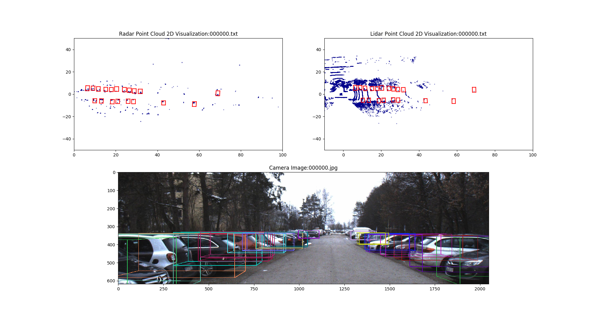
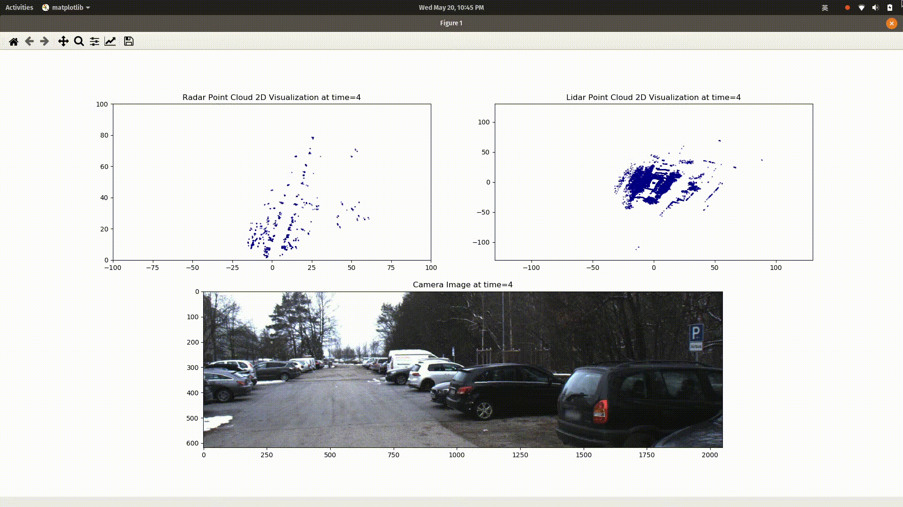

# Visualization of Astyx automotive sensor dataset

A visualization tool for Astyx multi-sensor data.

- `visualization_animation.py`:  dynamic visualize radar, lidar and camera data frame sequence.
- `visualization_annotation.py`:  visualize radar, lidar and camera data with annotation frame by frame.

## Usage

1. **Prepare Astyx data**
    
    download data from [Astyx official sample data download page](https://www.astyx.com/development/astyx-hires2019-dataset.html)

2. **Set environment variable**
    ```
    export AOD_HOME=/path/to/astyx/data/root/dir/
    ```
3. **Run scripts**
    
    For annotation:
    ```
    python visualization_annotation.py -s START -n COUNT
    ```
    where `START` is the first frame ID index to start displaying, `COUNT` is the number of frames to display.  

    For animation:
    ```
    python visualization_animation.py
    ```
4. **Keyboard Control (ONLY for annotation)**

    `left` / `up`: previous data frame
    
    `right` / `down`: next data frame 

## Sample results





